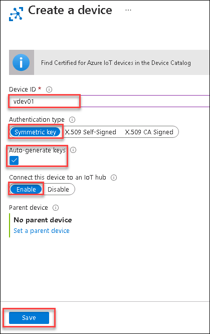
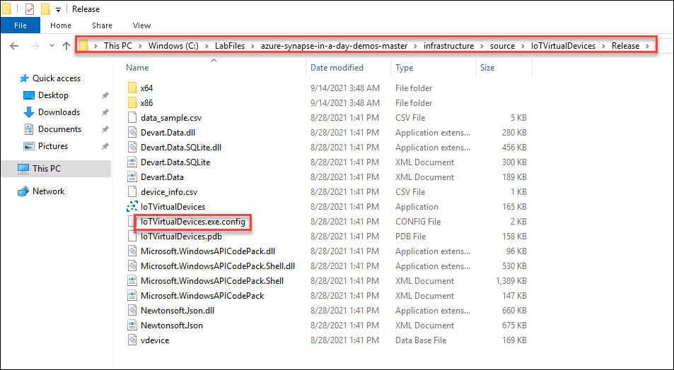
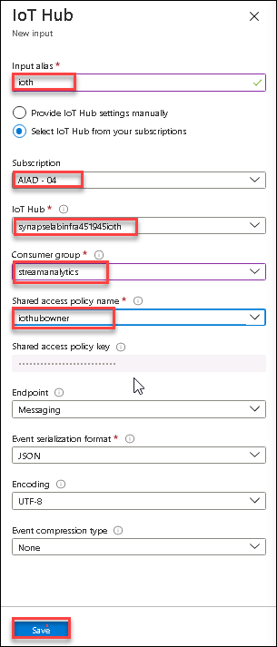
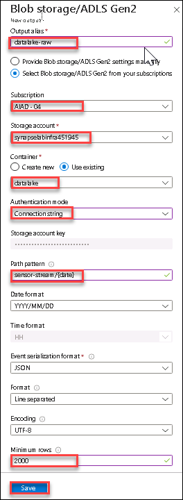

## Exercise 4: Create stream processing

Time required: 30 minutes


Create IoT Hub, Stream Analytics, receive sensor data, and implement real-time processing.

Stream Analytics coordinates sensor data received in JSON format with the data lake, and outputs the results of the average value at 30-second intervals in parallel as a parquet file.

**Note:**

The ability to output from Azure Stream Analytics to Synapse SQL Pool with high throughput of 200 MB/s has been announced.

Using Azure Stream Analytics with Azure Synapse Analytics: (https://docs.microsoft.com/azure/synapse-analytics/sql-data-warehouse/sql-data-warehouse-integrate-azure-stream-analytics)

**Note:**

Synapse Link with Cosmos DB can now be converted to column-oriented format with No-ETL to take advantage of data in column-oriented formats, such as Parquet file conversion.

Azure Synapse Link for Azure Cosmos DB: (https://docs.microsoft.com/azure/cosmos-db/synapse-link)

### Task 1: Configure IoT Hub resource

1. Navigate to the Azure portal (<https://portal.azure.com>).

2. In the search bar, type **IoT**, then select **IoT Hub** from the search results.

    

3. Select the IoT Hub resource you created for this lab, or that was provided to you in your lab environment.

    

4. Select **IoT devices** in the left-hand menu, then select **+Add Device** in the IoT devices blade.

    

5. Enter **vdev01** as the Device ID, select the **Symmetric key** authentication type, **Check** auto-generate key, and **Enable** the option to connect this device to an IoT Hub. Select **Save**.

    

6. Select the device ID of the new device you created.

    

7. Copy the **Primary Key** and save it to Notepad or similar text editor for later.

    

8. Navigate back to the IoT Hub resource and select **Built-in endpoints** on the left-hand menu. Scroll down to **Consumer Groups**. In the **Create a new consumer group** box, enter **streamanalytics**.

    

### Task 2: Event source settings

In this task, we configure the `IoTVirtualDevices` virtual device simulator that simulates and sends sensor data to Azure.

1. Select **Overview** in the left-hand menu of your IoT Hub. Copy the **Hostname** value and save it to Notebook or similar text editor for later.

    

2. Navigate to the location on your computer or Windows VM where you extracted the ZIP file for this lab. If you extracted it to `C:\`, navigate to `C:\Labfiles\azure-synapse-in-a-day-demos-master\infrastructure\source\IoTVirtualDevices\Release`. Open **IoTVirtualDevices.exe.config**.

    

3. Enter the **IoT Hub hostname** that you copied previously and save the configuration file, overwriting the previous value.

    

    ```xml
    <setting name="IOT_HUB_NAME" serializeAs="String">
        <value> YOUR_IOT_HUB_HOSTNAME_HERE </value>
    </setting>
    ```

4. Close the file and, in the same directory, open **device_info.csv**. Enter the **Primary key** for the IoT device that you copied earlier, then save the file.

    

    ```text
    DEVICE_ID,DEVICE_TYPE,SIGNING_KEY,DESCRIPTION
    vdev01,1,YOUR_PRIMARY_KEY_HERE,AIAD
    ```

5. Close the file and, in the same directory, right-click **IoTVirtualDevices.exe** and select **Run as administrator**.

    

6. If you receive a prompt asking you if you want to allow this app from an unknown publisher to make changes to your device, click **Yes**.

    

7. When the Virtual Devices application starts, click **File**, and then click **Normal Telemetry Data File Load**.

    

8. Select **data_sample.csv** in the `IoTVirtualDevices\Release\` folder, then select **Open**.

    

9. Click **OK** in the dialog that appears after loading.

    

10. Click the **Virtual Device Stopped** button to get started.

    

11. **Virtual Device Processing** is displayed.

    

12. Navigate to IoT Hub in the portal and, in the **Overview** blade, view the **IoT Hub Usage** chart. You should see the **Messages used today** count increase each time you **Refresh**.

    

### Task 3: Configure Stream Analytics resources

1. Navigate to the Azure portal (<https://portal.azure.com>).

2. In the search menu, type **stream**, then select **Stream Analytics jobs**.

    

3. Select the Stream Analytics job you created for this lab, or that was provided to you in your lab environment.

    

4. Select **Inputs** on the left-hand menu, select **+ Add stream input**, then **IoT Hub** in the drop-down menu.

    

5. In the `IoT Hub` form, enter the values shown in the table below. Select **Save**.

    

    | Parameters | Settings | Remarks |
    | --- | --- | --- |
    | Input alias | `ioth` | |
    | Subscription | Any | Select the Azure subscription used for this lab. |
    | IoT Hub | Any | Select the IoT Hub service you created for this lab |
    | Endpoint | Messaging | Default settings |
    | Shared access policy name | `iothubowner` | Default settings |
    | Consumer group | `streamanalytics` | Select the consumer group you created earlier |
    | Event serialization format | JSON | Default settings |
    | Encoding | UTF-8 | Default settings |
    | Event compression type | None | Default settings |

6. Select **Outputs** on the left-hand menu, select **+ Add**, then **Blob storage/ADLS Gen2** in the drop-down menu.

    

7. In the `Blob Storage/Data Lake Storage Gen2` form, enter the values shown in the table below. Select **Save**.

    

    | Parameters | Settings | Remarks |
    | --- | --- | --- |
    | Output alias | `datalake-raw` | |
    | Subscription | Any | Select the Azure subscription used for this lab. |
    | Storage account | Any | Select the data lake storage account you created when you deployed Synapse Analytics |
    | Container | `datalake` (choose use existing) | |
    | Authentication mode | Connection string |  |
    | Path pattern | `sensor-stream/{date}` | |
    | Date format | `YYYY/MM/DD` | Default settings |
    | Time format | HH | Default settings |
    | Event serialization format | JSON | Default settings |
    | Encoding | UTF-8 | Default settings |
    | Format | Line separated | Default settings |
    | Minimum rows | `2000` | |
    | Hours/minutes | `0` hours, `1` minute | |
    

8. Select **Outputs** on the left-hand menu, select **+ Add**, then **Blob Storage/Data Lake Storage Gen2** in the drop-down menu to add another output.

    

9. In the `Blob storage/ADLS Gen2` form, enter the values shown in the table below. Select **Save**.

    

    | Parameters | Settings | Remarks |
    | --- | --- | --- |
    | Output alias | `datalake-curated` | |
    | Subscription | Any | Select the Azure subscription used for this lab. |
    | Storage account | Any | Select the data lake storage account you created when you deployed Synapse Analytics |
    | Container | `datalake` (choose use existing) | |
    | Authentication mode | Connection string |  |
    | Path pattern | `curated/sensor_asa/{date}` | |
    | Date format | `YYYY/MM/DD` | Default settings |
    | Time format | HH | Default settings |
    | Event serialization format | Parquet |  |
    | Minimum rows | `2000` | Default settings |
    | Hours/minutes | `0` hours, `1` minute | Default settings |
    

10. Select **Query** in the left-hand menu. Copy and paste the following query into the query area on the right, then select **Save query**.

    ```sql
    --Use 30 second average
    SELECT
        DeviceId,
        Period,
        Cycle,
        dateadd(hour,9,system.timestamp) as JSTTime,
        AVG(Sensor11) as Sensor11,
        AVG(Sensor14) as Sensor14,
        AVG(Sensor15) as Sensor15,
        AVG(Sensor9) as Sensor9
    INTO [datalake-curated]
    FROM ioth TIMESTAMP BY EventEnqueuedUtcTime
    GROUP BY
        DeviceId,
        Period,
        Cycle,
        TUMBLINGWINDOW(ss,30);

    -- Use raw data as-is
    SELECT
        *
    INTO [datalake-raw]
    FROM ioth TIMESTAMP BY EventEnqueuedUtcTime
    ```

    

11. Select **Overview** in the left-hand menu, then select **Start**.

    

12. In the Start job dialog, select **Start** to begin the job.

    
    
  Click on **Next** in the below to proceed with the lab.
