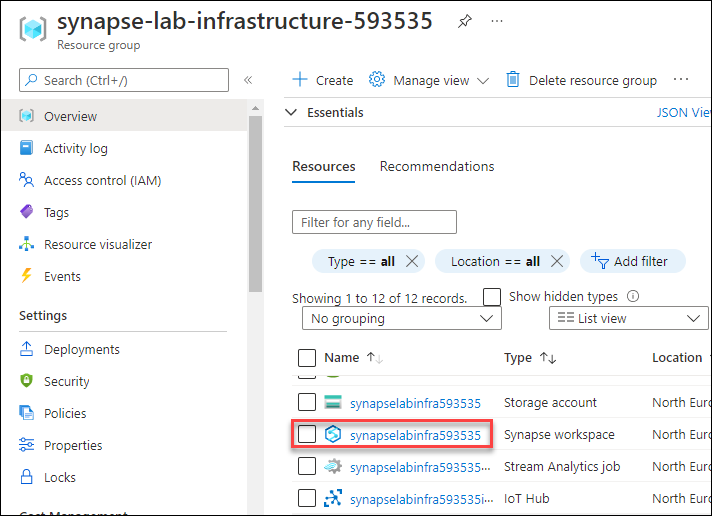

## Exercise 5: Explore Data with Query-as-a-Service

Time required: 15 minutes


In addition to the traditional SQL data warehouse functionality, Azure Synapse Analytics has added serverless SQL pools as a way to execute SQL queries directly against the data lake. Serverless SQL pools do not have persistent tables, but are billed based on query run time, enabling rapid data search and cost optimization.

### Task 1: Query for Parquet files

1. Return to Synapse Studio (<https://web.azuresynapse.net/>) and select the **Data** hub.

    

2. Select the **Linked** tab, expand the primary storage (data lake) account, and open the **datalake** container. Select the **curated** folder. If this folder is not visible, refresh the view after the Stream Analytics query runs for a few minutes.

    

3. Open the **sensor_asa** folder.

    

4. Navigate through the sub-folders until you get to the list of Parquet files. Right-click the Parquet file stored at the bottom of the list and select **New SQL script**, then **Select TOP 100 rows**.

    

    > **Note**: You will not see the same folder structure since they are automatically generated based on the current date.

5. Select **Run** to execute the query. You should see the file contents listed in the results below after the query execution completes.

    

### Task 2: Create a view

1. Clear the query and replace it with the following, then select **Run** to execute.

    ```sql
    --Create user database for SQL on-demand
    CREATE DATABASE [AIAD]
    ```

2. Select AIAD in the **Use database** list. You may need to select the **Refresh** button to find it in the list. If this doesn't work, change the **Connect to** to `aiaddw`, then back to `SQL on-demand`.

    

3. Clear the query and replace it with the query below. **Replace YOUR_STORAGE_ACCOUNT_NAME with your storage account name**, using the primary data lake storage account as a reference.

    

    ```sql
    --Create a View for Datalake
    CREATE VIEW v_sensor_ondemand AS
    SELECT
        *,
        convert(date,left(JSTTIME,10)) as JSTDate
    FROM
        OPENROWSET(
            BULK 'https://YOUR_STORAGE_ACCOUNT_NAME.dfs.core.windows.net/datalake/curated/sensor_asa/*/*/*/*.parquet',
            FORMAT='PARQUET'
        ) AS [r]
    --Condition clauses can be stated for the partition structure of the folder
    WHERE 
        r.filepath(1) = YEAR(getdate())
    AND r.filepath(2) = MONTH(getdate())
    ```

4. Select **Run** to execute the query.

5. Clear the query and replace it with the query below, then select **Run**.

    

    ```sql
    -- Verify number of Views
    SELECT
        COUNT(1)
    FROM
        v_sensor_ondemand
    ```

### Task 3: Create near-real-time dashboards

1. Return to the **synapse-lab-infrastructure-<inject key="UniqueId" enableCopy="false"/>** resource group and select the Azure Synapse Analytics workspace within.

     
    
2. In the **Overview** blade, copy the **Serverless SQL endpoint** value.

    

3. Open Power BI Desktop. Close the sign-in window with the **X** on the upper-right corner.

    

4. Select **Get Data**, then select **Azure** in the left-hand menu of the dialog that appears. Select **Azure Synapse Analytics SQL**, then select **Connect**.

    

5. Set the **Server** value to your copied serverless SQL endpoint, and enter **AIAD** for the **Database** name. Select the **DirectQuery** data connectivity mode, then click **OK**.

    

6. Select **Microsoft account** on the left-hand menu. **Sign in**, then click **Connect**.

    

7. Click the box to the left of **v_sensor_ondemand**, which will load the data in the preview to the right. Click **Load**.

    

8. Under Visualizations, select **Line chart**, then use the table below to set the field values.

    | Parameters | Settings | Remarks |
    | --- | --- | --- |
    | X-axis | `JSTTime` | |
    | Legend | `DeviceId` | |
    | Y-axis | `Sensor9` | |

    

9. Click an empty location in the report area. Under Visualizations, select **Slicer**, then use the table below to set the field values.

    | Parameters | Settings | Remarks |
    | --- | --- | --- |
    | Field | `DeviceId` | |

    

    > When you select a Device Id in the slicer, it filters all other visualizations by that value.

10. Click an empty location in the report area. Under Visualizations, select **Card**, then use the table below to set the field values.

    | Parameters | Settings | Remarks |
    | --- | --- | --- |
    | Fields | `JSTTime` | Select the dropdown next to JSTTime and select **Earliest**. |

    


12. Click the **Save** icon on the top-left. Enter **SensorOnDemand** for the file name and click **Save**. You will use this file in a later exercise.

    
    
 Click on **Next** in the below to proceed with the lab.
