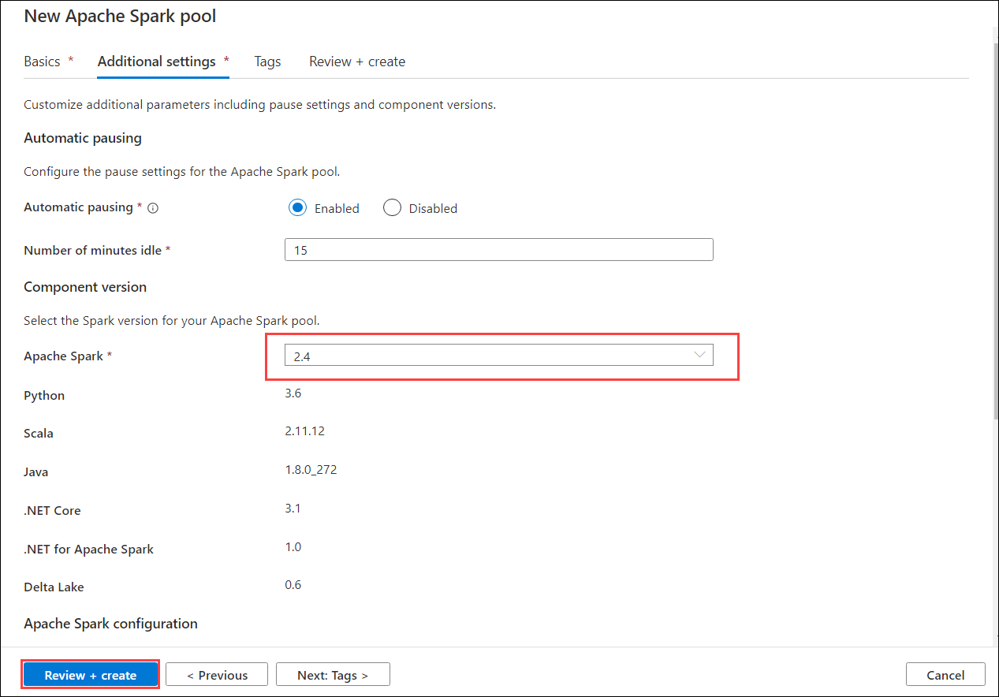
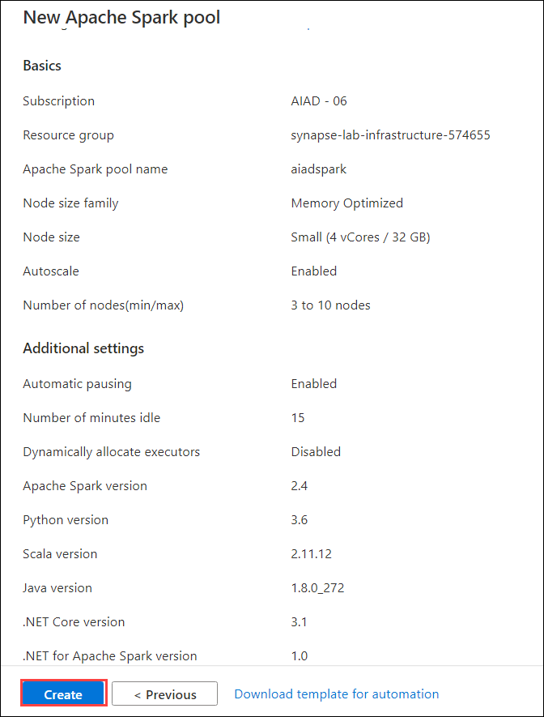
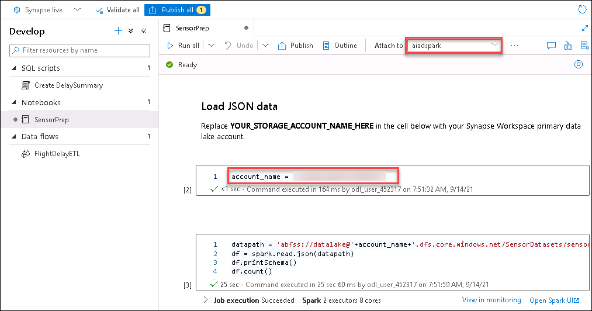

## Exercise 6: Create a structured process for large amounts of data with Spark

Time required: 10 minutes

In addition to SQL analysis, Synapse Analytics enables analysis and development with Spark, a distributed processing framework for OSS. By using Spark, you can select a development language (Python, Scala, .Net) tailored to your skill set and develop a structure to process large-scale data at high speed.

### Task 1: Create a Spark pool

Spark pools are configured as an environment running Spark and are automatically stopped/scaled according to usage, resulting in cost-optimized, on-demand ETL processing.

1. Return to Synapse Studio (<https://web.azuresynapse.net/>) and select the **Manage** hub, **Apache Spark pools**, then select **+ New**.

    

2. Enter each setting as shown in the table below, then select **Next: Additional settings**.

    

    | Parameters | Settings | Remarks |
    | --- | --- | --- |
    | Apache Spark pool name | `aiadspark` | |
    | Node size | Small | |
    | Autocale | Enabled | Default settings |
    | Number of nodes | 3-10 | Default settings |

    > **Note**: If **Estimated Price** displays **Failed to parse billing response**, Please **Ignore** it and proceed with the next steps.

3. On the Additional settings page select Apache Spark version as **2.4**, then select **Review + create**.

   

4. Review the settings, then select **Create**.

    

### Task 2: Develop Spark ETL

Synapse Studio's Notebook UI is provided as an interface for developing Spark. Using your notebook, you can interact with Spark ETL and create simple charts.

In this task, you will use the `SensorPrep.ipynb` notebook in the `source/ETLandPREDICT` folder.

1. Select the **Develop** hub.

    

2. Select **+**, then select **Import** from the drop-down menu.

    

3. Navigate to the folder where you extracted the ZIP file for this lab. If you extracted the files to `C:\LabFiles`, navigate to `C:\LabFiles\azure-synapse-in-a-day-demos-master\infrastructure\source\ETLandPREDICT` and select **SensorPrep.ipynb**.

    

4. With the `SensorPrep` notebook open, Attach to **aiadspark** which you created before and edit the storage `account_name` value in **Cell 2**. Enter just the account name (eg. `synapselabinfra311568`) and not the fully-qualified name. Run the cells in the notebook one by one.

    

5. With **Cell 2** selected, press **Shift+Enter**. The contents of **Cell 2** will run and the cursor moves to **Cell 3**. Similarly, press **Ctrl+Enter** to run the selected cell and remain there without moving on to the next cell.

    

6. When you execute **Cell 10**, change the view to **Chart** in the cell results. Select **View options** and configure the settings as displayed below, then select **Apply**.

    

    | Parameters | Settings |
    | --- | --- |
    | Chart type | Line chart |
    | Key | `timestamp_PST` |
    | Values | `Period`, `Sensor11` |
    | Series Group | |
    | Aggregation | MAX |
    | Aggregation over all results | Unchecked |

7. When you are finished running all of the cells in the notebook, select the **Stop session** button on the top-right corner of the notebook, then select **Stop now** when prompted. This ends the Spark session so that the compute resources are free to execute the next notebook.

    

Click on **Next** in the below to proceed with the lab.
