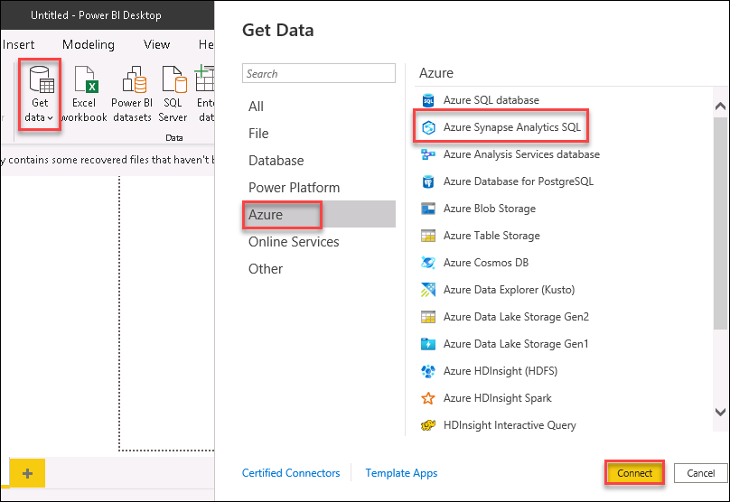

## Exercise 8: Visualize with Power BI

Time required: 10 minutes

Create a sensor summary report in Power BI.

### Task 1: Create connections and relationships

1. Return to the **synapse-lab-infrastructure-<inject key="UniqueId" enableCopy="false"/>** resource group and select the Azure Synapse Analytics workspace within.

    

2. In the **Overview** blade, copy the **SQL endpoint** value.

    

3. Open Power BI Desktop and open the **SensorOnDemand.pbix** report if it is not already open. Click **Get Data**, choose **Azure** from the left-hand menu, select **Azure Synapse Analytics SQL**, then click **Connect**.

    

4. Set the **Server** value to your copied SQL endpoint, and enter **aiaddw** for the **Database** name. Select the **DirectQuery** data connectivity mode, then click **OK**.

    

5. **Optional**: If you are prompted to sign in, select **Microsoft account** on the left-hand menu. **Sign in**, then click **Connect**.

    

6. Check the check boxes next to **PREDICT_SensorRUL** and **Sensor**, then click **Load**.

    

7. If you get prompted by Power BI Desktop that adding new data sources presents a potential security risk, click **OK** to build the model.

    

8. Select the **Modeling** tab, then click **Manage relationships** in the menu.

    

9. Click **New**.

    

10. Select the **PREDICT_SensorRUL** table in the first drop-down list, then select **Sensor** in the second drop-down list. Click **OK** to apply the table relationship. Notice that it automatically selected `DeviceId` as the relationship key and set the cardinality to `1:*`.

    

11. Click **New** to create a new relationship.

    

12. Select the **PREDICT_SensorRUL** table in the first drop-down list, then select **v_sensor_ondemand** in the second drop-down list. Click **OK to apply the table relationship. This adds a relationship to the SQL serverless (On-demand) view you created earlier.

    

13. Click **Close**.

    

14. On the Report tab, click **+** to add a new report.

    

15. Click an empty location in the report area. Under Visualizations, select **Table**, then use the table below to set the field values.

    | Parameters | Settings | Remarks |
    | --- | --- | --- |
    | Field | `DeviceId` | `PREDICT_SensorRUL` table |
    | Field | `RUL` | `PREDICT_SensorRUL` table |
    | Field | `avgSensor9` | `PREDICT_SensorRUL` table |
    | Field | `avgSensor11` | `PREDICT_SensorRUL` table |
    | Field | `avgSensor14` | `PREDICT_SensorRUL` table |
    | Field | `avgSensor15` | `PREDICT_SensorRUL` table |

    

16. Click an empty location in the report area. Under Visualizations, select **Clustered column chart**, then use the table below to set the field values.

    | Parameters | Settings | Remarks |
    | --- | --- | --- |
    | X-axis | `DeviceId` | `PREDICT_SensorRUL` table |
    | Legend | | |
    | Y-axis | `Cycle` | `Sensor` table |

    

17. Click **Cycle** and select **Maximum**. This lets us verify how many cycles were sustained before required maintenance for each Device.

    

18. Click an empty location in the report area. Under Visualizations, select **Line chart**, then use the table below to set the field values.

    | Parameters | Settings | Remarks |
    | --- | --- | --- |
    | X-axis | `Cycle` | `Sensor` table |
    | Legend | `DeviceId` | `PREDICT_SensorRUL` table|
    | Y-axis | `Sensor11` | `Sensor` table |

    

19. Click **Sensor11** to and select **Average** to make sure that the sensor blur is growing in the second half of the cycle prior to maintenance.

    

20. **Save** the report.

Click on **Next** in the below to proceed with the lab.
